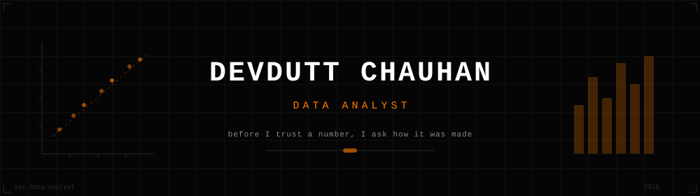
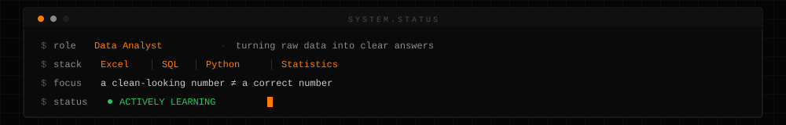
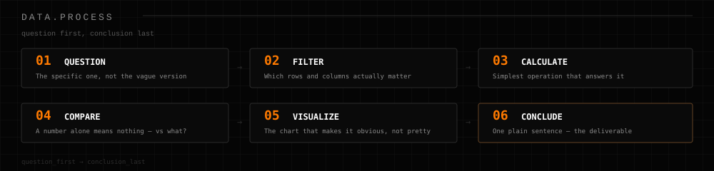
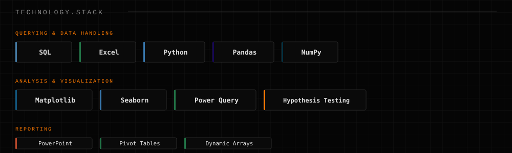

  

 

  

  

## About

There's one habit I keep coming back to, whatever I'm working on: **before I trust a number, I ask how it was made.**

Right now, that means going deep on **Excel, SQL, Python, and Statistics** — not as separate skills, but as different tools for the same job: taking raw, messy, real-world data and turning it into something a person can actually act on. Along the way, I've had to catch and fix real data problems — the kind that don't announce themselves, they just quietly give you the wrong answer until you go looking.

A short stretch in digital marketing gave me my first real exposure to this — comparing data across sources, checking it for accuracy, and turning research into a recommendation someone else would act on. It's a small part of how I got here, but it's where I first learned that a clean-looking number and a correct number aren't always the same thing.

  

  

 

## Currently Focused On

A few things are currently in progress — they'll show up here once they're actually finished, not before.

  

## How I Think Through Data

  

## Technology Stack

  

  

 

## Where AI Fits Into How I Think

I'm not trying to build models — I'm trying to understand them well enough to question them. A model's output isn't automatically right just because it's fast: a low-confidence guess deserves more scrutiny than a high-confidence one, and there's a real difference between a model *inventing* something that isn't there and *misreading* something that is. That distinction shapes how I think about data quality in general — AI-generated or not.

  

## GitHub Analytics

 

  

  

 

  

 

&nbsp;

  

